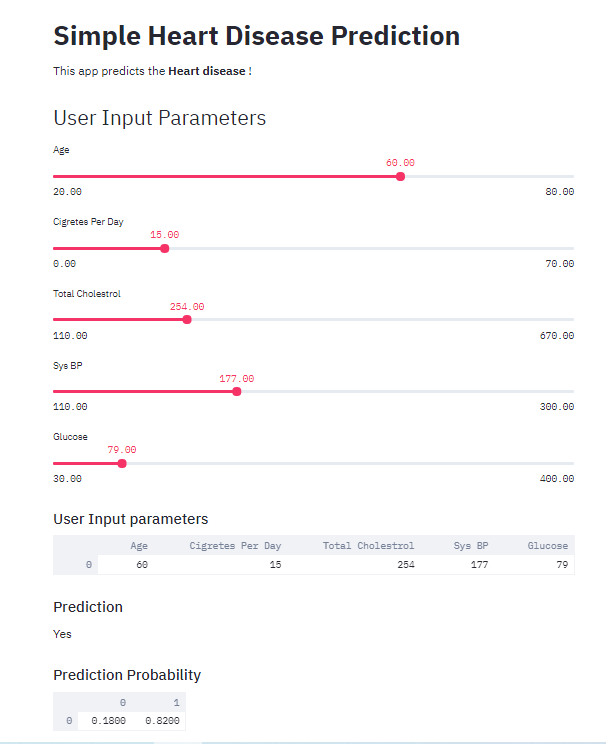

# heart disease prediction web app deployed on Heroku

The deployed web app is live at https://heart-disease-by-shahdab.herokuapp.com/

This web app predicts the type of breast cancer as a function of their input parameters ( Age, Cigretes_Per_Day, Total_Cholestrol, Sys BP, Glucose ).

The web app was built in Python using the following libraries:

* streamlit
* pandas
* pickle

